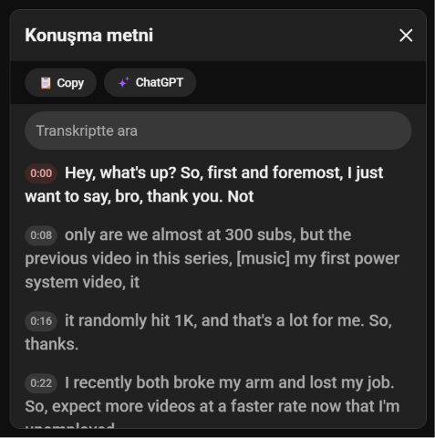

# YouTube Transcript to AI

Free Chrome extension — no API keys, no accounts, no tracking. It auto-opens the transcript panel on YouTube videos and adds two buttons:

| Button | What it does |
|---|---|
| 📋 **Copy** | Copies the transcript with timestamps to your clipboard |
| ✨ **AI** | Opens Claude, ChatGPT, or Gemini in a new tab — temporary/incognito chat, transcript pre-filled |

Click the extension icon to choose your AI provider, edit the prompt, and toggle including the video description.

> **Why isn't this on the Chrome Web Store?** Google charges a $5 developer fee. This extension is free, so: manual install. It takes 30 seconds.



## Install

1. **[⬇ Download ZIP](https://github.com/HamzaYslmn/youtube-transcript-summarizer-free/archive/refs/heads/main.zip)** and extract it
2. Open `chrome://extensions` in Chrome (copy-paste it into the address bar)
3. Turn on **Developer mode** (toggle, top right)
4. Click **Load unpacked** → select the extracted folder

Open any YouTube video that has a transcript — the panel opens by itself with the buttons in it.

## How it works

- ChatGPT gets the prompt via URL (`?temporary-chat=true&prompt=`)
- Claude and Gemini have no such URL support, so a helper script clicks their incognito/temp-chat button and types the prompt in
- The prompt is always copied to your clipboard too — if a site's UI changed, just paste (Ctrl+V)

Message format:

```
{prompt}

Transcript:
{transcript}

Video Description:
{video description}
```

